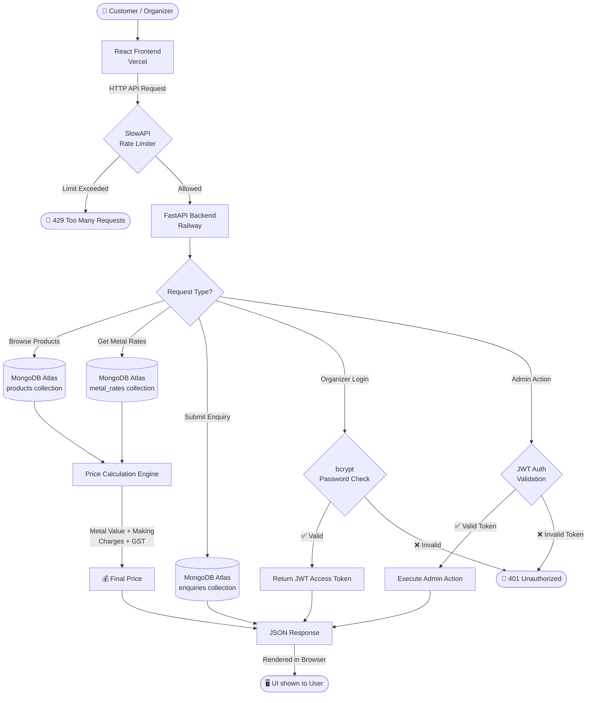
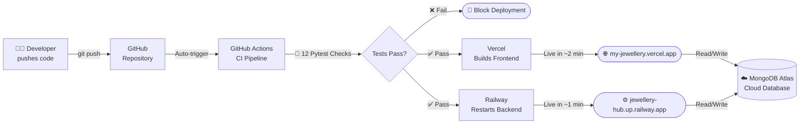

<div align="center">

# 💎 SAM Gold Works
### *Where Tradition Meets Elegance Since 1995*

**A premium full-stack jewellery web application — browse collections, see live gold/silver prices, and enquire with one tap.**

<br/>

[](https://my-jewellery.vercel.app)
[](https://jewellery-hub.up.railway.app/api/)
[](#-tech-stack)
[](#)

</div>

---

## 📸 Screenshots

<table>
  <tr>
    <td align="center"><b>🏠 Home Page</b></td>
    <td align="center"><b>💍 Collections</b></td>
  </tr>
  <tr>
    <td></td>
    <td></td>
  </tr>
  <tr>
    <td align="center"><b>📊 Metal Rates</b></td>
    <td align="center"><b>📬 Contact Page</b></td>
  </tr>
  <tr>
    <td></td>
    <td></td>
  </tr>
  <tr>
    <td align="center"><b>🔐 Organizer Login</b></td>
    <td align="center"><b>🛠️ Admin Dashboard</b></td>
  </tr>
  <tr>
    <td></td>
    <td></td>
  </tr>
</table>

---

## 🤔 What Is This?

Think of this as a **digital showroom** for a jewellery shop:

- 🛍️ **Customers** can browse jewellery, see today's gold/silver prices, and contact the shop via WhatsApp or a form — all from their phone or computer.
- 🔐 **The shop owner (organizer)** logs in with a password to manage products, update metal rates, and view customer enquiries.
- ☁️ **Everything is online** — no app to install, works on any device, data is stored securely in the cloud.

---

## ✨ Features

### For Customers (Public)
| Feature | Description |
|---------|-------------|
| 🏠 **Home Page** | Beautiful landing page with hero section and metal rate ticker |
| 💍 **Collections** | Browse all jewellery with filters (Gold/Silver/Diamond, category, occasion) |
| 💰 **Live Prices** | Each product shows a real-time price calculated from today's metal rates |
| 📊 **Metal Rates Page** | See today's Gold 22K, Gold 24K, Silver & Diamond rates with price formula |
| 🔍 **Product Detail** | Full image gallery, specifications, and transparent price breakdown |
| 📬 **Contact Form** | Send an enquiry directly to the shop |
| 💬 **WhatsApp Button** | One-tap to chat with the shop on WhatsApp |
| 📖 **About & Workshop** | Learn about the shop's 30-year history and crafting process |

### For the Shop Owner (Admin Dashboard)
| Feature | Description |
|---------|-------------|
| 🔐 **Secure Login** | Password-protected organizer dashboard |
| 📦 **Manage Products** | Add, edit, or delete jewellery products with images |
| 📈 **Update Metal Rates** | Set today's Gold/Silver/Diamond rates (prices update instantly for all visitors) |
| 📬 **View Enquiries** | See all customer messages with name, email, and phone |
| ⭐ **Testimonials** | Approve or reject customer reviews before they go live |
| 📊 **Analytics** | See total products, enquiries, and bestsellers at a glance |

### Backend Architecture & Security
| Feature | Description |
|---------|-------------|
| 🛡️ **Rate Limiting** | SlowAPI prevents abuse by throttling login (5/min) and enquiries (10/min) |
| 🔐 **JWT Auth** | Stateless, secure admin authentication with token validation |
| ✅ **Data Validation** | Strict Pydantic models ensure all API requests and responses are 100% type-safe |
| 🧪 **Test Suite** | Comprehensive Pytest suite with fully mocked MongoDB database operations |
| 🔄 **CI/CD Pipeline** | GitHub Actions automatically runs tests and build checks on every push |


## 🧠 System Architecture & Workflow

> Here is how data flows through **SAM Gold Works** to serve customers and the organizer.



---

### ⚙️ How It Works — Step by Step

1. **Customer visits the website** → The React frontend loads in their browser (hosted on Vercel)

2. **Product data is fetched** → The frontend sends a request to the FastAPI backend (hosted on Railway)

3. **Backend queries the database** → FastAPI talks to MongoDB Atlas (cloud database) to get products, metal rates, and testimonials

4. **Price is calculated in real-time** → For every product:
   ```
   Metal Rate (₹/g)  ×  Weight (g)   =  Metal Value
                                      +  Making Charges (10% of Metal Value)
                                      +  GST on Metal   (3% of Metal Value)
                                      +  GST on Making  (5% of Making Charges)
                                      ─────────────────────────────────────
                                      =  💰 Final Price shown to Customer
   ```

5. **Customer enquires** → Contact form or WhatsApp button sends the enquiry directly to the shop

6. **Organizer logs in** → Password is verified using bcrypt. If correct, a JWT (JSON Web Token) is generated and stored securely in the browser.

7. **Organizer manages content** → Admin requests include the JWT token. The backend verifies the token and allows add/edit products, updating rates, and viewing enquiries.

8. **Rate Limiting** → SlowAPI prevents abuse by limiting login attempts (5/min) and enquiry submissions (10/min) per IP address.

---

### 🔄 Deployment Pipeline




## 🛠️ Tech Stack

| Layer | Technology | Why? |
|-------|-----------|------|
| **Frontend** | React.js + TailwindCSS | Fast, modern, responsive UI |
| **UI Components** | shadcn/ui (Radix) | Beautiful, accessible components |
| **Animations** | Framer Motion + Lenis | Smooth, premium feel |
| **Backend** | FastAPI (Python) | Fast, clean REST API |
| **Database** | MongoDB Atlas | Flexible, cloud-hosted NoSQL |
| **Auth** | Passlib + bcrypt | Secure password hashing |
| **Frontend Deploy** | Vercel | Auto-deploys on every GitHub push |
| **Backend Deploy** | Railway | Always-on server with env var support |

---

## 📂 Project Structure

```
My-Jewellery/
│
├── 📁 .github/workflows/
│   └── ci.yml                 ← GitHub Actions CI/CD pipeline
│
├── 📁 project/
│   │
│   ├── 📁 backend/
│   │   ├── 📁 tests/          ← Pytest suite with database mocks
│   │   ├── server.py          ← Main API server (all routes & logic)
│   │   ├── create_organizer.py ← Script to create admin account
│   │   ├── requirements.txt   ← Python dependencies
│   │   └── .env               ← Secret keys (NOT uploaded to GitHub)
│   │
│   ├── 📁 frontend/
│   │   ├── 📁 src/
│   │   │   ├── 📁 pages/      ← All 8 website pages
│   │   │   ├── 📁 components/ ← Navbar, Footer, UI components
│   │   │   └── App.js         ← Main app with routing
│   │   ├── 📁 public/
│   │   │   └── index.html     ← Entry HTML file
│   │   └── package.json       ← Node.js dependencies
│   │
│   └── 📁 scripts/
│       └── seed_data.py       ← Populates database with sample data
│
└── README.md                  ← You are here!
```

---

## 🚀 Getting Started (Local Setup)

> **Prerequisites**: You need [Node.js](https://nodejs.org/) and [Python 3.9+](https://python.org/) installed.

### Step 1 — Clone the Project
```bash
git clone https://github.com/abdulsami-S/My-Jewellery.git
cd My-Jewellery/project
```

### Step 2 — Set Up the Backend
```bash
cd backend
pip install -r requirements.txt
```

Create a `.env` file in the `backend/` folder:
```
MONGO_URL=mongodb+srv://<username>:<password>@cluster.mongodb.net/jewellery
DB_NAME=jewellery
```

Start the backend server:
```bash
uvicorn server:app --reload
# API running at http://localhost:8000
```

### Step 3 — Set Up the Frontend
```bash
cd ../frontend
npm install
```

Create a `.env` file in the `frontend/` folder:
```
REACT_APP_BACKEND_URL=http://127.0.0.1:8000
```

Start the frontend:
```bash
npm start
# Website running at http://localhost:3000
```

### Step 4 — Run Backend Tests
```bash
cd ../backend
python -m pytest tests/
# Runs all 12 tests using an isolated, mocked database
```

---

## 📡 Key API Endpoints

| Method | Endpoint | What it does |
|--------|----------|--------------|
| `GET` | `/api/products` | Get all jewellery products |
| `GET` | `/api/products/{id}/price` | Get full price breakdown for a product |
| `GET` | `/api/metal-rates` | Get today's gold/silver/diamond rates |
| `GET` | `/api/bestsellers` | Get top products by popularity |
| `POST` | `/api/enquiries` | Submit a customer enquiry |
| `POST` | `/api/organizer/login` | Admin login |
| `PUT` | `/api/metal-rates` | Update metal rates (admin) |

---

## ☁️ Deployment

| Service | Platform | URL |
|---------|----------|-----|
| Frontend | Vercel | https://my-jewellery.vercel.app |
| Backend | Railway | https://jewellery-hub.up.railway.app |
| Database | MongoDB Atlas | Cloud (private) |

> Vercel auto-deploys whenever code is pushed to the `main` branch on GitHub.

---

## 🧠 What I Learned Building This

- ✅ How to build a full-stack app from scratch and deploy it to the cloud
- ✅ How React routing and component-based architecture works
- ✅ How to design REST APIs with FastAPI and connect to MongoDB
- ✅ How to implement secure authentication with bcrypt password hashing
- ✅ How to calculate real-world jewellery pricing (metal rates + GST)
- ✅ How to write automated Pytest suites with completely mocked database connections
- ✅ How to protect APIs using Rate Limiting and strict Pydantic schema validation
- ✅ How to debug deployment issues between local and production environments
- ✅ How GitHub Actions, Vercel, and Railway continuous deployment pipelines work

---

## 🎯 Purpose

This project was built to gain hands-on experience in full-stack web development with real-world features — authentication, database integration, cloud deployment, and dynamic pricing logic. It simulates a production-ready business application for a local jewellery shop.

---

## 👨‍💻 Author

<div align="center">

**Abdul Sami**

</div>

---

<div align="center">

## ⭐ If You Like This Project

**Give it a star on GitHub — it really helps!** ⭐

</div>
